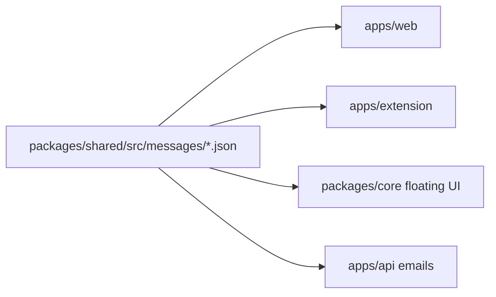

# Internationalization (i18n)

This project supports 7 user-interface locales:
`en` / `zh-CN` / `ja` / `ko` / `es` / `fr` / `de`.

The user-facing surfaces covered are:
- Marketing pages (landing, pricing, etc.) and app pages (try, login, settings, billing) under `apps/web`
- Browser extension popup / options / floating UI under `apps/extension` and `packages/core`
- Onboarding emails under `apps/api/src/emails`
- API error code → message mapping rendered client-side

## Two locale concepts — keep them separate

| Concept | Decided by | Stored as | Used for |
|---|---|---|---|
| **UI locale** | URL prefix > `NEXT_LOCALE` cookie > `Accept-Language` > `'en'`. Logged-in users override via `user_settings.ui_locale` | `user_settings.ui_locale` (`'auto' \| Locale`); cookie `NEXT_LOCALE` (`Locale`) | Interface text everywhere — landing copy, popup, settings labels, email body |
| **Content locale** | `user_settings.target_lang` + `packages/core/src/lang/detect.ts` priority chain | `user_settings.target_lang` (`'auto' \| BCP-47`) | Which language the rewrite output is generated in |

A British user typing in Chinese can perfectly well want the rewrite in Chinese.
Don't conflate the two.

## Single source of truth

```
packages/shared/src/messages/
├── en.json       ← source of truth (manually authored)
├── zh-CN.json    ← manually authored
├── ja.json       ← AI-translated, awaiting native review
├── ko.json       ← AI-translated, awaiting native review
├── es.json       ← AI-translated, awaiting native review
├── fr.json       ← AI-translated, awaiting native review
└── de.json       ← AI-translated, awaiting native review
```

Four consumers all import from here:



Practical wiring:

- **`apps/web`** — `apps/web/i18n/request.ts` static-imports all 7 JSON files via
  the `@rewrite/shared/messages/*.json` package export. next-intl's
  `getRequestConfig` returns the matching catalog per request. No copy step.
- **`apps/extension`** — popup/options can `import en from '@rewrite/shared/messages/en.json'`
  (Vite resolves through the package exports map).
- **`packages/core`** — floating UI calls the lightweight `t(key, locale)` function
  from `@rewrite/shared` (which internally has all 7 catalogs imported).
- **`apps/api/src/emails`** — server-side template functions take a `locale` and
  pick the right subject/body strings (templates inline their HTML; only key
  short phrases come from the catalog to keep terms consistent).

## Message key naming

- Lowercase, dot-separated, semantically grouped:
  `error.rateLimit`, `cta.installExtension`, `home.hero.eyebrow`, `meta.login.title`.
- Top-level namespaces in use today:
  `meta` · `nav` · `footer` · `home` · `page` · `hint` · `cta` · `state` · `error` · `placeholder`.
- Use ICU placeholders for dynamic values: `{count}`, `{count, number}`, `{email}`.
- Use ICU rich tags for embedded markup: `<kbd>Shift</kbd>`, `<strong>...</strong>`,
  `<repo>github.com/...</repo>`. Render via `t.rich()` with a tag-name → renderer map.
- Don't translate technical demo text (sample inputs/outputs, code-style log
  examples) — they're stylized illustrations, treated as English-only by design.

## URL routing

- next-intl `localePrefix: 'as-needed'` configured in `apps/web/i18n/routing.ts`:
  - `/` → English (default; no prefix)
  - `/zh-CN/...`, `/ja/...`, `/ko/...`, `/es/...`, `/fr/...`, `/de/...` → respective locale
- `apps/web/middleware.ts` matcher excludes `/_next`, `/_vercel`, `/api/...`,
  `/v1/...`, and any path containing a `.` (static assets). API rewrites in
  `next.config.mjs` therefore pass through.
- The `NEXT_LOCALE` cookie (set by next-intl middleware on first visit) carries
  the user's preference forward across navigations.

## SEO

- `apps/web/app/[locale]/layout.tsx` `generateMetadata` outputs:
  - `<title>` and `<meta description>` per locale
  - `<link rel="canonical" href="...{localePath}/">`
  - `<link rel="alternate" hreflang="...">` × 7 plus `x-default` → root.
- `apps/web/app/sitemap.ts` enumerates `PUBLIC_PATHS` × 7 locales.  Each `<url>`
  carries `xhtml:link rel="alternate"` covering all locales.  When you add a
  public route, append it to `PUBLIC_PATHS`.

## Adding a new locale

1. Create `packages/shared/src/messages/{locale}.json` (start by copying en.json,
   then translate).
2. Append the locale to `LOCALES` in `packages/shared/src/i18n.ts` and import
   the new JSON.
3. Append the locale to `routing.locales` in `apps/web/i18n/routing.ts`.
4. Append it to the `uiLocale` enum white-list in
   `apps/api/src/routes/me.ts` (PATCH `/v1/me/settings` validator).
5. Update `pickLocale` in `packages/shared/src/i18n.ts` if the new locale
   shouldn't fall through to `'en'` for ambiguous BCP-47 tags.
6. Run `pnpm i18n:validate` — should be green. Run `pnpm typecheck` — `Locale`
   union expansion will surface any switch statements that need new branches
   (e.g., extension `LANG_OPTIONS`).
7. Add the locale to `LABELS` / `SHORT` in `apps/web/components/LanguageSwitcher.tsx`.
8. Email templates: extend the per-locale switch in `apps/api/src/emails/templates.ts`.

## Translation workflow

- `en.json` is the source of truth — written and reviewed manually.
- `zh-CN.json` is also reviewed manually (project author is bilingual).
- `ja` / `ko` / `es` / `fr` / `de` are AI-translated, marked in commits as
  *"AI-translated, awaiting native review"*. Native reviewers will eventually
  produce final copy.
- A future `scripts/i18n-translate.mjs` (Stage 8 follow-up) will read each
  locale's source-hash cache (`messages/{locale}.cache.json`), diff against
  `en.json`, and call an LLM only for missing or source-changed keys —
  idempotent across runs and won't blow over a human-edited translation.

## Testing strategy (avoiding matrix explosion)

- Unit / integration: loop over all 7 locales (each test < 50 ms; total stays
  manageable).
- E2E (Playwright): test only `en`, `zh-CN`, and `ja` — covers Latin / CJK
  spacing / Japanese mixed scripts. The other 4 are exercised manually before
  release.
- **No snapshot tests for translated content** — translations change too often
  and snapshots add noise. Use `textContent`/keyword assertions instead.

## CI gates

- `pnpm i18n:validate` runs on every PR (added to `.github/workflows/ci.yml`).
  Fails if:
  - any locale catalog has a key set differing from `en.json`
  - any leaf value is `null`, an object, or an empty string
- `pnpm lint` and `pnpm typecheck` of course also run.
